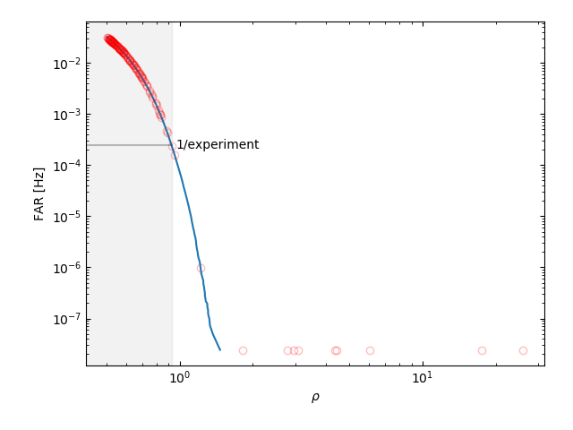

# Gravity Assignment 3

  * 30% of final grade
  * assigned 29 Sep 2023
  * due 13 Oct 2023

---

## Problem 1

Simulated data was generated via (this script is contained within Gravity-Assignment-3)

```
./make-data \
    --seed 123456789 \
    --duration 4096 \
    --sample-rate 512 \
    --noise-sigma 1.0 \
    --signal-rate 0.005 \
    --prior A 0.001 10.0 \
    --prior fo 1.0 \
    --prior tau 2.0 \
    --verbose
```

and we can see the signals in the data below:


There are clearly a few signals visible in the data "by eye".

We grab the helper code from the assignment repo via

```
./fetch
```

We run our search via

```
./search \
    assignment-3.hdf \
    --fo 1.0 \
    --tau 2.0 \
    --snr-thr 0.5 \
    --num-noise-realizations 10000 \
    --tukey-alpha 0.05 \
    --Verbose
```

which produces




and we see that there are 10 triggers that are detected with FARs significantly lower than 1/experiment.
These are

```
>>> import h5py
>>> params = h5py.File('search-triggers.hdf', 'r')['params'][:]
>>> for param in params[params['FAR'] < 0.1/4096]:
...     print('    to=%9.3f ; FAR=%.6e Hz' % (param['to'], param['FAR']))
... 
    to=  500.553 ; FAR=2.441406e-08 Hz
    to= 1386.773 ; FAR=2.441406e-08 Hz
    to= 1655.465 ; FAR=2.441406e-08 Hz
    to= 2297.906 ; FAR=2.441406e-08 Hz
    to= 2417.188 ; FAR=2.441406e-08 Hz
    to= 2637.480 ; FAR=9.598029e-07 Hz
    to= 3014.223 ; FAR=2.441406e-08 Hz
    to= 3124.277 ; FAR=2.441406e-08 Hz
    to= 3131.855 ; FAR=2.441406e-08 Hz
    to= 3885.791 ; FAR=2.441406e-08 Hz
```
