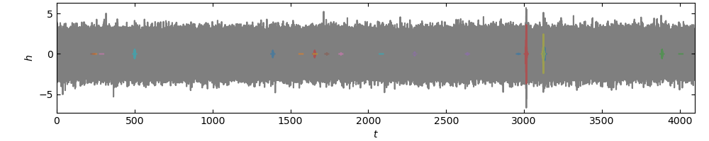
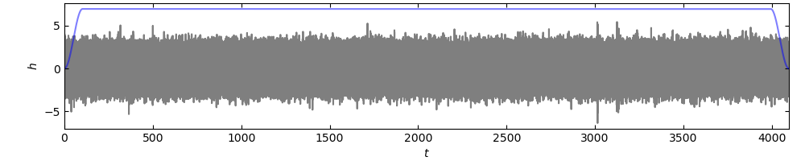
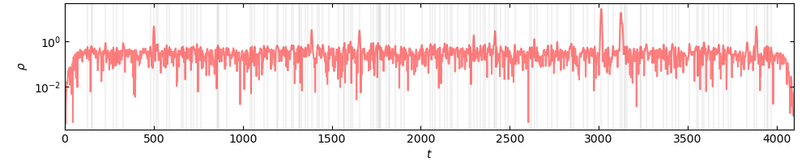

# Gravity Assignment 3

  * 30% of final grade
  * assigned 29 Sep 2023
  * due 13 Oct 2023

---

## Problem 1

Simulated data was generated via (this script is contained within Gravity-Assignment-3)

```
./make-data \
    --seed 123456789 \
    --duration 4096 \
    --sample-rate 512 \
    --noise-sigma 1.0 \
    --signal-rate 0.005 \
    --prior A 0.1 5.0 \
    --prior fo 1.0 \
    --prior tau 2.0 \
    --verbose
```

and we can see the signals in the data below:



There are clearly a few signals visible in the data "by eye".

We grab the helper code from the assignment repo via

```
./fetch
```

We run our search via
```
./search \
    assignment-3.hdf \
    --fo 1.0 \
    --tau 2.0 \
    --snr-thr 0.50 \
    --tukey-alpha 0.05 \
    --verbose
```

which produces





**WRITE TABLE OF TRIGGER PROPERTIES**
